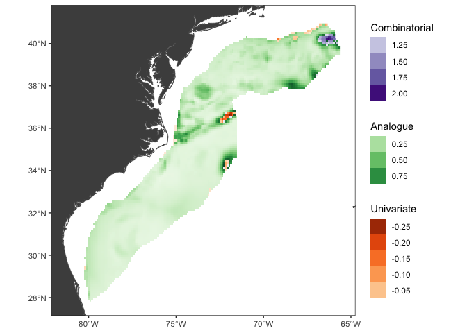
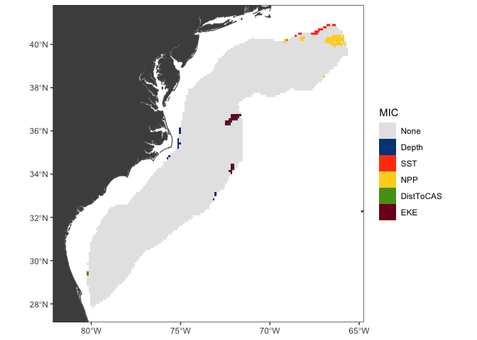

<!-- README.md is generated from README.Rmd. Please edit that file -->

[](https://pifsc-protected-species-division.r-universe.dev/dsmextraLite)

# Installation

## R-Universe

#### Binary

``` r
install.packages('dsmextraLite', 
                 repos=c('https://pifsc-protected-species-division.r-universe.dev','https://cloud.r-project.org')
)
```

#### Source

``` r
install.packages('dsmextraLite', type='source', 
                 repos=c('https://pifsc-protected-species-division.r-universe.dev','https://cloud.r-project.org')
)
```

## Github

``` r
remotes::install_github('pifsc-protected-species-division/dsmextraLite')
```

# Example

    #> 
    #> 
    #> Table: Extrapolation
    #> 
    #> Type            Count         Percentage  
    #> --------------  ------------  ------------
    #> Univariate      65            1.23        
    #> Combinatorial   45            0.85        
    #> -----------     -----------   ----------- 
    #> Sub-total       110           2.08        
    #> -----------     -----------   ----------- 
    #> Analogue        5175          97.92       
    #> -----------     -----------   ----------- 
    #> Total           5285          100         
    #> 
    #> 
    #> Table: Most influential covariates (MIC)
    #> 
    #> Type            Covariate     Count         Percentage  
    #> --------------  ------------  ------------  ------------
    #> Univariate      EKE           24            0.45        
    #> Univariate      SST           17            0.32        
    #> Univariate      Depth         16            0.3         
    #> Univariate      NPP           6             0.11        
    #> Univariate      DistToCAS     2             0.038       
    #> -----------     -----------   -----------   ----------- 
    #> Sub-total                     65            1.2         
    #> -----------     -----------   -----------   ----------- 
    #> Combinatorial   NPP           39            0.74        
    #> Combinatorial   Depth         6             0.11        
    #> -----------     -----------   -----------   ----------- 
    #> Sub-total                     45            0.85        
    #> -----------     -----------   -----------   ----------- 
    #> Total                         110           2.1
    #> Warning: Removed 21254 rows containing missing values or values outside the scale range
    #> (`geom_raster()`).
    #> Warning: Removed 21237 rows containing missing values or values outside the scale range
    #> (`geom_raster()`).
    #> Warning: Removed 16117 rows containing missing values or values outside the scale range
    #> (`geom_raster()`).

<!-- -->

    #> Warning: Removed 15996 rows containing missing values or values outside the scale range
    #> (`geom_raster()`).

<!-- -->

# Disclaimer

*This software package is developed and maintained by scientists at the
NOAA Fisheries Pacific Islands Fisheries Science Center and should be
considered a fundamental research communication. The recommendations and
conclusions presented here are those of the authors and this software
should not be construed as official communication by NMFS, NOAA, or the
U.S. Dept. of Commerce. In addition, reference to trade names does not
imply endorsement by the National Marine Fisheries Service, NOAA. While
the best efforts have been made to insure the highest quality, tools
such as this are under constant development and are subject to change.*
